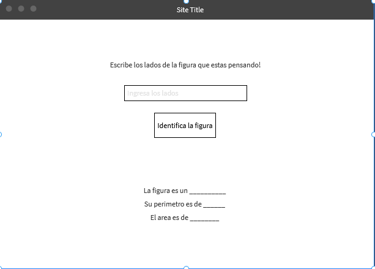

# INSTRUCCIONES
1. Se desea crear una pagina que reciba en una entrada una cantidad de lados.
2. Despues de ingresarla, se debe de calcular el area, el perimetro e identificar que figura es.
3. Una vez que se identifique, se debe mostrar en pantalla.

# REQUERIMIENTO

  

  

# REFERENCIAS
[Cheatsheet html5/css/js](https://lenguajehtml.com/cheatsheets/)
[Botones en css](https://www.bestcssbuttongenerator.com/#/25)
